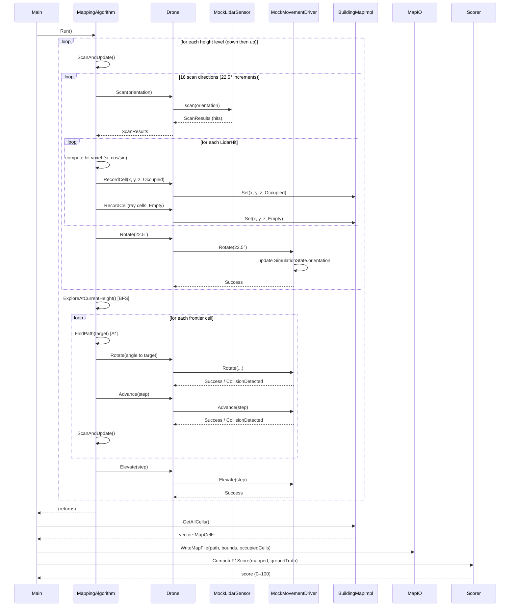

# Drone Mapper — High-Level Design

TAU Advanced Topics in Programming, Semester B 2026 — Assignment 1

---

## 1. System Overview

The Drone Mapper is a C++20 simulation of an autonomous 3D building-mapping drone.
The drone navigates a bounded 3D space, fires a lidar sensor in multiple directions at
each height level, records occupied voxels, and writes a sparse 3D occupancy map.
All sensors and the movement driver are software mocks; no real hardware is involved.

---

## 2. UML Class Diagram

```mermaid
classDiagram
    direction TB

    %% ── Type System ────────────────────────────────────────────────────────
    class Units {
        <<types>>
        +PhysicalLength  (mp::quantity isq::length[cm])
        +XLength         (mp::quantity x_extent[cm])
        +YLength         (mp::quantity y_extent[cm])
        +ZLength         (mp::quantity z_extent[cm])
        +HorizontalAngle (mp::quantity horizontal_angle[deg])
        +Altitude        (mp::quantity altitude_angle[deg])
        +Position3D      \{XLength x; YLength y; ZLength z\}
        +Orientation     \{HorizontalAngle horizontal; Altitude altitude\}
    }

    %% ── Interfaces ─────────────────────────────────────────────────────────
    class ILidarSensor {
        <<interface>>
        +scan(Orientation) ScanResults
    }

    class IPositionSensor {
        <<interface>>
        +position() Position3D
        +heading()  Orientation
    }

    class IMovementDriver {
        <<interface>>
        +Rotate(HorizontalAngle) MoveResult
        +Advance(PhysicalLength) MoveResult
        +Elevate(PhysicalLength) MoveResult
    }

    class IBuildingMap {
        <<interface>>
        +Get(XLength, YLength, ZLength) MapValue
        +Set(XLength, YLength, ZLength, MapValue) void
    }

    class IMap3D {
        <<interface>>
        +get(Position3D) int
    }

    %% ── Simulation Layer ────────────────────────────────────────────────────
    class SimulationState {
        +Position3D  position
        +Orientation orientation
    }

    class MockLidarSensor {
        -LidarConfig config_
        -IMap3D map_
        -IPositionSensor pos_sensor_
        +scan(Orientation) ScanResults
        -traceBeam(Orientation) optional~PhysicalLength~
    }

    class MockPositionSensor {
        -shared_ptr~SimulationState~ m_state
        +position() Position3D
        +heading()  Orientation
    }

    class MockMovementDriver {
        -shared_ptr~SimulationState~ m_state
        -DroneConfig m_config
        -CellMap m_cellMap
        +Rotate(HorizontalAngle) MoveResult
        +Advance(PhysicalLength) MoveResult
        +Elevate(PhysicalLength) MoveResult
    }

    class CellMap {
        -unordered_map~Key,int~ m_cells
        +get(Position3D) int
        -makeKey(Position3D) Key
    }

    %% ── Drone Layer ─────────────────────────────────────────────────────────
    class Drone {
        -ILidarSensor    m_lidar
        -IPositionSensor m_position
        -IMovementDriver m_driver
        -IBuildingMap    m_map
        +Rotate(HorizontalAngle) MoveResult
        +Advance(PhysicalLength) MoveResult
        +Elevate(PhysicalLength) MoveResult
        +Scan(Orientation) ScanResults
        +GetLocation() Position3D
        +RecordCell(XLength, YLength, ZLength, MapValue) void
        +QueryCell(XLength, YLength, ZLength) MapValue
    }

    class BuildingMapImpl {
        -unordered_map~Key,MapValue~ m_cells
        -PhysicalLength m_xyCellCm
        -PhysicalLength m_hCellCm
        -vector~pair~ m_boundary
        +Get(XLength, YLength, ZLength) MapValue
        +Set(XLength, YLength, ZLength, MapValue) void
        +GetAllCells() vector~MapCell~
        -IsInsideBoundary(XLength, YLength) bool
        -MakeKey(XLength, YLength, ZLength) Key
    }

    class MappingAlgorithm {
        -Drone m_drone
        -DroneConfig m_config
        -MissionConfig m_mission
        -set~GridCell3D~ m_visited
        -queue~GridCell3D~ m_frontier
        +Run() void
        -ScanAndUpdate() void
        -ScanSingleDirection() void
        -ExploreAtCurrentHeight() void
        -FindPath(GridCell3D) vector~GridCell3D~
        -MoveToCell(GridCell3D) bool
        -RotateToFace(XLength, YLength) bool
        -AdjustHeight(PhysicalLength) bool
    }

    %% ── I/O Layer ────────────────────────────────────────────────────────────
    class ConfigParser {
        <<utility>>
        +ParseDroneConfig(path, DroneConfig, ErrorLogger) bool
        +ParseMissionConfig(path, MissionConfig, ErrorLogger) bool
    }

    class MapIO {
        <<utility>>
        +ParseMapFile(path, ErrorLogger) ParsedMap
        +WriteMapFile(path, MapBounds, cells) bool
    }

    class Scorer {
        <<utility>>
        +ComputeF1Score(mapped, groundTruth) double
    }

    %% ── Relationships ────────────────────────────────────────────────────────
    MockLidarSensor     ..|> ILidarSensor
    MockPositionSensor  ..|> IPositionSensor
    MockMovementDriver  ..|> IMovementDriver
    BuildingMapImpl     ..|> IBuildingMap
    CellMap             ..|> IMap3D

    MockLidarSensor     --> IMap3D         : reads occupancy
    MockLidarSensor     --> IPositionSensor : reads pose
    MockMovementDriver  --> SimulationState : writes position/orientation
    MockPositionSensor  --> SimulationState : reads position/orientation
    MockMovementDriver  --> CellMap         : collision check

    Drone --> ILidarSensor
    Drone --> IPositionSensor
    Drone --> IMovementDriver
    Drone --> IBuildingMap

    MappingAlgorithm --> Drone

    MapIO ..> CellMap  : ParsedMap input
```

---

## 3. Sequence Diagram — One Height-Level Scan Cycle

The following diagram shows the sequence for one iteration of the mapping loop:
scan in 16 directions, BFS-explore the frontier, then move to the next height level.



---

## 4. Design Rationale

### 4.1 Layered Architecture

The system is divided into three layers, separated by interfaces:

| Layer | Components | Responsibility |
|---|---|---|
| **I/O** | ConfigParser, MapIO, ErrorLogger, Scorer | File parsing, writing, scoring |
| **Simulation** | MockLidarSensor, MockPositionSensor, MockMovementDriver, CellMap | Simulate physics and sensors |
| **Drone** | Drone façade, BuildingMapImpl, MappingAlgorithm | Algorithm and map building |

All simulation objects communicate through abstract interfaces (`ILidarSensor`, `IPositionSensor`,
`IMovementDriver`, `IMap3D`). Swapping real sensors for mocks requires no changes to the drone or
algorithm code — only the construction in `main.cpp` changes.

### 4.2 Strong Physical Types (mp-units)

All distance and angle values use `mp-units` quantities instead of raw `double`. This prevents
unit-confusion bugs (e.g., passing centimetres where degrees are expected) at compile time, with
zero runtime overhead. Trigonometric functions (`si::cos`, `si::sin`, `si::atan2`) operate directly
on angle quantities, eliminating manual degree-to-radian conversions and the precision errors they
introduce — critical for correct floor-based voxel indexing.

Key types:
- `PhysicalLength` = `mp::quantity<isq::length[cm], double>` — generic distance
- `XLength / YLength / ZLength` — axis-specific distances (distinct types prevent axis confusion)
- `HorizontalAngle / Altitude` — distinct angle types for compass vs. tilt

### 4.3 Shared Simulation State

`SimulationState` (position + orientation) is held in a `shared_ptr` and shared by all three mock
objects. `MockMovementDriver` writes to it; `MockPositionSensor` and `MockLidarSensor` read from it.
This accurately models sensor fusion without coupling the mock implementations to each other.

### 4.4 Sparse 3D Occupancy Map

`BuildingMapImpl` stores only cells that have been observed (Occupied or Empty) in an
`unordered_map` keyed by `(floor(x_cm), floor(y_cm), floor(z_cm))`. This is memory-efficient
for large, mostly-empty spaces. Unvisited cells implicitly have value `NotMapped (-1)`.

The same floor-based key is used in `CellMap`, `BuildingMapImpl`, and `Scorer`, guaranteeing
that a lidar hit, its recorded voxel, and its score lookup all refer to the same cell.

### 4.5 Mapping Algorithm

The algorithm uses three nested loops:

1. **Outer loop — height sweep**: descends from `startHeight` to `minHeight`, then ascends to
   `maxHeight`, scanning and exploring at each level. Bidirectional sweep ensures complete
   vertical coverage even when the drone starts in the middle of the height range.

2. **Middle loop — BFS frontier**: at each height level, a BFS queue tracks unvisited reachable
   cells. The drone moves to each frontier cell using A\* path planning on the current occupancy
   map, avoiding walls and already-mapped obstacles.

3. **Inner loop — 16-direction scan**: at each position, the drone fires lidar in 16 directions
   (22.5° increments), covering the full 360°. Each scan records hit voxels as Occupied and
   cells along the beam as Empty, building up the map incrementally.

### 4.6 Lidar Model (Professor's Design)

`MockLidarSensor` fires concentric circles of beams around the drone. Each circle `n` has beams
at radius `n × circle_spacing`. Each beam is traced in 0.1 cm steps until it hits an occupied
voxel (via `CellMap::get`), reaches `beam_length_max`, or the first step is blocked. This matches
the professor's reference implementation exactly, enabling fair comparison against reference output.

---

## 5. Key Data Flows

### 5.1 Startup

```
main.cpp
  → ParseDroneConfig   → DroneConfig
  → ParseMissionConfig → MissionConfig
  → ParseMapFile       → ParsedMap (ground truth for lidar + scoring)
  → construct CellMap(ParsedMap)
  → construct SimulationState, all mocks, Drone
  → MappingAlgorithm::Run()
```

### 5.2 Lidar Hit → Voxel Record

```
LidarHit { distance, angle (relative to drone heading) }
  → absolute angle = hit.angle + drone.heading
  → direction vector: (cos(alt)·cos(horiz), cos(alt)·sin(horiz), sin(alt))
  → hit position = drone_pos + distance × direction
  → floor(hit_x_cm), floor(hit_y_cm), floor(hit_z_cm) → BuildingMapImpl key
  → Set(x, y, z, Occupied)
```

### 5.3 Scoring

```
BuildingMapImpl.GetAllCells() → filter Occupied → mapped[]
ParsedMap.cells               → groundTruth[]
ComputeF1Score:
  TP = cells in both mapped and groundTruth
  FP = cells in mapped but NOT in groundTruth
  FN = cells in groundTruth but NOT in mapped
  F1 = 2·TP / (2·TP + FP + FN) × 100
```

Score < 100 is expected and correct when cells are physically unreachable
(e.g., interior voxels of solid objects, cells hidden behind solid walls).

---

## 6. Test Scenarios

| Scenario | Space | Obstacle | Expected Score | Reason for < 100 |
|---|---|---|---|---|
| scenario1 | 24×24×16 cm room | 4×4×10 cm solid pillar (centre) | 98.2 / 100 | Interior voxels of pillar unreachable by lidar |
| scenario2 | 20×20×20 cm hollow room | None | 100.0 / 100 | All surfaces reachable |
| scenario3 | 5×5×5 cm space | Double-thickness wall | 77.8 / 100 | Cells behind solid wall cannot be detected |

Reference outputs are in each scenario's `original_output/` folder.
